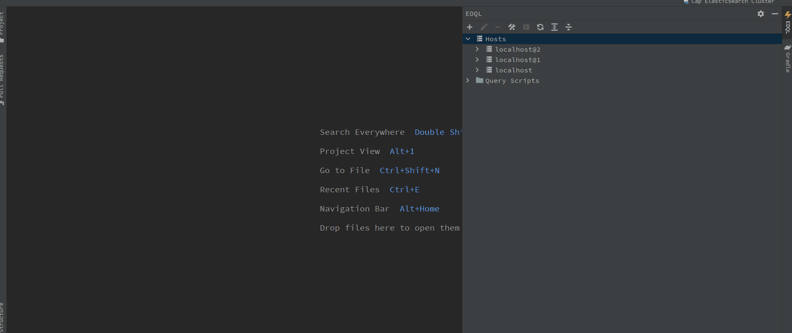
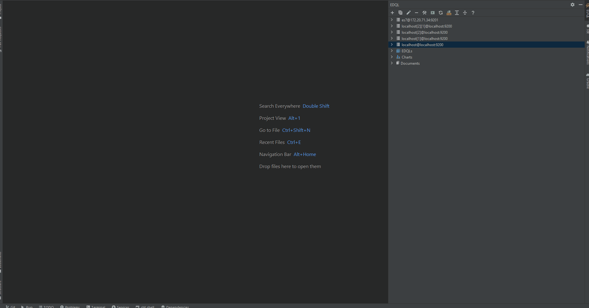
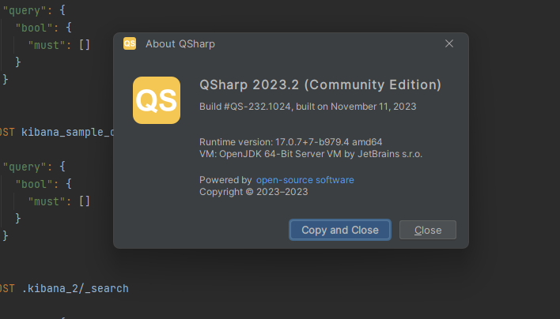

# EDQL—Elasticsearch GUI Client and QSharp Elasticsearch IDE

[EDQL](https://plugins.jetbrains.com/plugin/16364-elasticsearch-query--edql/) is a professional query and management tool for Elasticsearch. It's intelligent and powerful for manage Elasticsearch cluster and query from Elasticsearch. also It always follow Elasticsearch newest features.


EDQL is cross-platform since it's based on intellij, so It can be used on windows, linux or macOS.


**The most important EDQL feature is full compatible with official Query DSL**, It means we can copy query DSL from document and run directly without any extra effort. also EDQL has visual editor feature that can help you use interactive UI to query Elasticsearch without know Elasticsearch syntax.

> Elasticsearch Query DSL is complex and hard to learn, event we can use SQL or simple DSL directly query Elasticsearch, but in most cases such as we want to aggs complex time-series data and dig data value, it's hard to achieve. also query dsl is not easily share with team members, but we always want to efficiently collaborate

so based on the above scenarios **EDQL** implements powerful script engine: support function, variable and iteration etc. with intelligent Intellij you can easily write query DSL(autocomplete, refactor, live templates, extract etc).



For aggregations, **EDQL** support plotting aggregation results in Intellij directly for analysis data(find more: ), that's powered by vega-lite plot library and is fully compatible with kibana vega-lite plot.


[plot.md](tutorials/plot.md)


## Feature Overview

<details>

<summary>Connections Management</summary>

Manage Elasticsearch connections: new, delete, modify and test connection. list indices, scripts, nodes, templates, tasks and nodes etc. also new index, modify index, new script, modify script etc.

</details>

<details>

<summary>Query</summary>

Query with official Query DSL without any extra effort. so you can quickly verify query syntax and check data

</details>

<details>

<summary>Data Browser</summary>

EDQL for query result it support 3 modes: table mode, JSON mode, plot mode, and these modes support search, highlight, fields selection etc. also we can new modify, delete and export(scroll) documents on Data Viewer table mode.

</details>

<details>

<summary>Script Function</summary>

Works like a script with function, variable or iteration etc, so can quickly create personal query template or library for handling common use cases to reduce duplicate code. also can convert function to IDE shortcut action so we can quickly run function in common scenes

</details>

## Getting Started

### 1. Connect to Elasticsearch

Connect to Elasticsearch by using EDQL Dock Manager, it's default **on the Intellij right side**. In the EDQL Dock Manager, you can **add a new connection to connect Elasticsearch and Test connectivity**.



### 2. Start New Query Console

After create and test a connection of Elasticsearch, you can create new query console on the Dock Toolbar with terminal icon:

```
POST myindex/_search
{
  "query": {
    "match_all": {}
  }
}
```

or

```
var myindex = "myindex"
#fields
var fields = [
  "a",
  "b",
  "c"
]
POST $myindex/_search
{
  "_source": $fields,
  "query": {
    "match_all": {}
  }
}
```

> Query index _**myindex**_ with custom source fields

<figure><figcaption></figcaption></figure>

### Guides: Jump right in

Follow our handy guides to get started on the basics as quickly as possible:


[install-edql-on-intellij.md](getting-started/install-edql-on-intellij.md)



[create-edql-script.md](getting-started/create-edql-script.md)



[run-edql-request.md](getting-started/run-edql-request.md)


### Use cases with EDQL

EDQL is not only target for query also can help solve multi scenarios problems, you could find use cases by:


[query-data.md](tutorials/query-data.md)



[analysis-data.md](tutorials/analysis-data.md)



[manage-cluster.md](tutorials/manage-cluster.md)


### Explore More about EDQL Syntax

Experience the power of EDQL, a comprehensive scripting solution that fully supports Elasticsearch Query DSL. With EDQL, you can explore a wide range of features, including functions, variables, collections, types, and iteration. Dive into the world of EDQL and unleash the full potential of scripting with Elasticsearch Query DSL:


[basic-syntax.md](syntax/basic-syntax.md)



[script-syntax.md](syntax/script-syntax.md)



[glossary.md](syntax/glossary.md)


## QSharp EDQL IDE

[QSharp IDE](https://github.com/chengpohi/edql/releases) is a powerful standalone IDE designed specifically for Elasticsearch querying. Unlike the EDQL plugin that requires installation within the Intellij IDE, QSharp can be installed independently. This is particularly useful for users who prefer not to install Intellij IDE solely for using EDQL.

<figure><figcaption></figcaption></figure>
