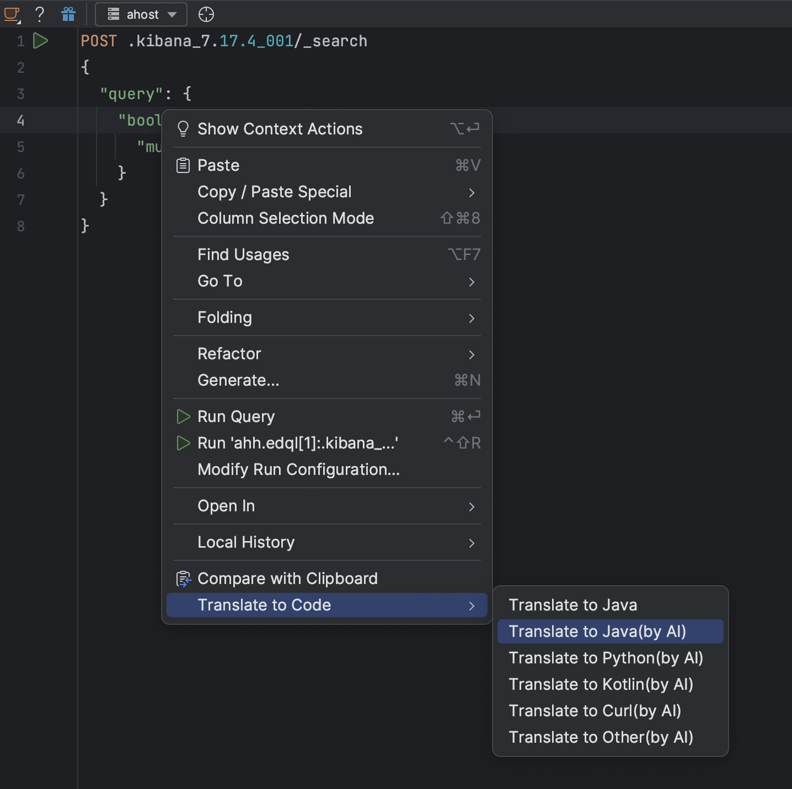

# Effortlessly Convert Elasticsearch Query DSL to Code (Java, Python cURL) by ChatGPT

## Background

Elasticsearch's powerful query capabilities are undoubtedly a game-changer, but the complexity of the DSL can often be a barrier for developers. Translating these queries into the appropriate code format, whether it's Java, Python, cURL, or any other language, can be a time-consuming and error-prone process.

## The Solution: EDQL - Convert feature

**EDQL**, the Elasticsearch Query GUI client, has been designed to address this challenge head-on. With its latest feature, DSL **Query Conversion**, users can now effortlessly translate their Elasticsearch DSL queries into a variety of programming language formats, including:

* Java
* Python
* cURL
* Other Language

This innovative feature leverages the power of large language models, such as ChatGPT and other AI-generated content (AIGC) technologies, to provide accurate and reliable code translations. Users can  translate their Elasticsearch DSL query  automatically generate the corresponding code snippets for their desired programming language.\
\
So users can easily to test query and convert query to code for quickly debug  and verify  result.

<figure><figcaption></figcaption></figure>

## Unleash the Power of EDQL

Experience the transformative power of EDQL's Query Conversion feature and take your Elasticsearch workflow to new heights. Download EDQL today and witness the seamless integration of Elasticsearch DSL into your preferred programming languages, unlocking a world of possibilities for your data management and analysis needs.

[https://chengpohi.github.io/getting-started/install-edql-on-intellij/](https://chengpohi.github.io/getting-started/install-edql-on-intellij/)

