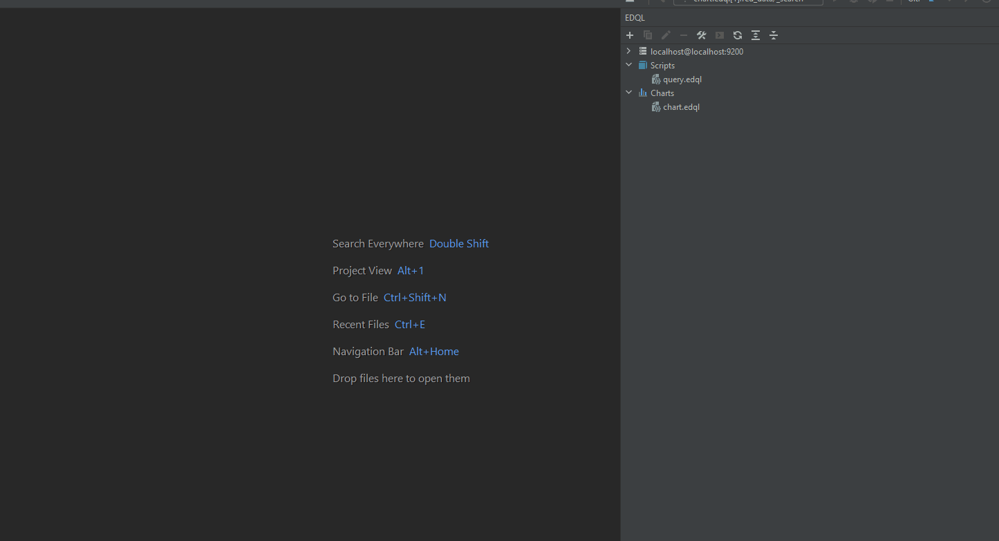

## Run Result Panel

After running Elasticsearch query, the running result will display on a result panel, result panel include: left, middle
and right panels.

### Execution Details

Execution details display time usage for query

### Data Panel

Display the query result data, support 3 mode: table mode, json mode and plot mode:

- table mode will flatten Elasticsearch source data to row and remove noise data
- json mode will display whole query result as foldable json data
- plot mode will display query data by vega-lite format

### Explain&Profile Panel

Display the query explain and profile info when a run query with "explain": true, "profile": true

## Table Mode

Elasticsearch most of the data can be displayed as table mode includes: source hits, aggregation response, mapping and
templates, etcs.

### Documents

Elasticsearch source hits documents default will display as table view and will remove noise info: shards, time etc.

### Aggregations

Aggregation result always includes a nest object, it's hard to display and view, but EDQL has achieved flatten nested
object to table view. So we can quickly and easily view the aggregate result.

### Mappings

Index mapping in Elasticsearch designs its nest object json. But usually we just want to focus on a field type and name.

### Features

- Search
- Add
- Edit
- Delete
- Commit
- Fields Filter
- Fit Pane

## JSON Mode

In sometime some data it's hard to display table directly, In these scenarios the query response will directly display
as JSON

## Plot Mode

In plot mode, user can plot by using vega-lite syntax to plot Elasticsearch response.

### Plot Aggregation

- plot metric
- plot date histogram
- plot stats
- multi line plot

