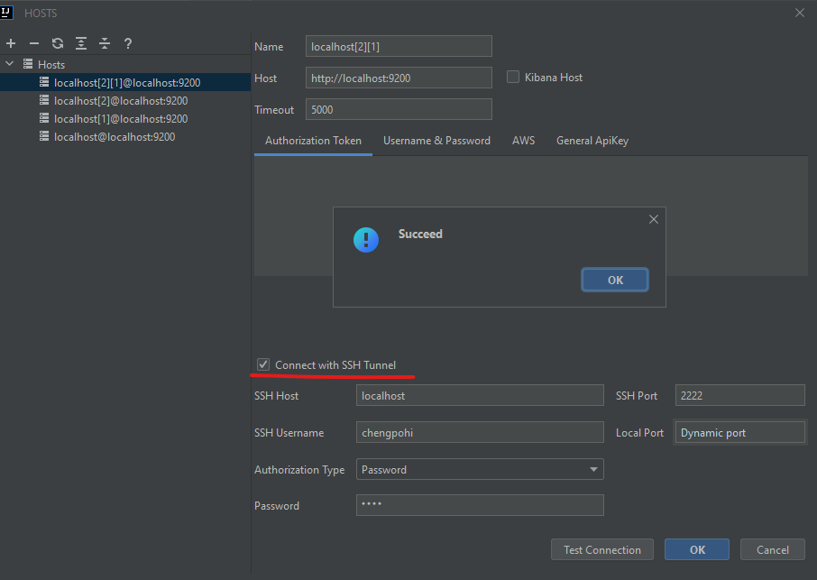
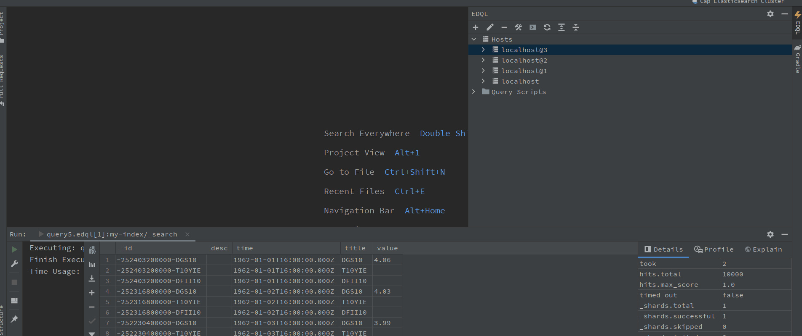

# Connection and Query

## 1 Connection

Connect to Elasticsearch by using EDQL Dock Manage default **on the Intellij right side**. In the EDQL Dock Manager, you can **add new connection to connect Elasticsearch and Test connection**.

View more on:


[configure-connection.md](../configuration/configure-connection.md)


## 2 Authorization

### 2.1 Authorization Token

Use authorization token to connect Elasticsearch cluster, such as basic token, bearer token or custom token

### 2.2 Username & Password

Basic username, password

### 2.3 AWS

Use aws region, api key id, api key secret to connect aws Elasticsearch, also you can custom AWS profile to use

### 2.4 General ApiKey

Use general api key to connect Elasticsearch cluster, such as Elastic cloud

### 2.5 SSH Tunnel

Use an SSH tunnel to encrypt a connection between a client and a server to connect Server, Or make connections inside same VPC(Virtual Private Cloud), Example: connect aws server in the same VPC.

<figure><figcaption></figcaption></figure>

### 2.6 HTTP Proxy

Use HTTP Proxy to connect Elasticsearch with http proxy

## 3 Query Console

After creating and testing a connection of Elasticsearch, You can create a new query console on the Dock Toolbar with terminal icon

## 3.1 Query by Visual Editor

After EDQL file is created, we can use the **Visual Editor** to configure a query action, since the common query conditions are annoying and boring. Visual Editor is a powerful tool for visual query conditions and configurations, example: term match, range query, wildcard query and size, explain etc.

