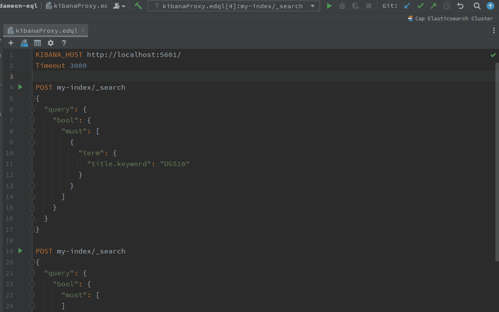

# Run Query and Data Viewer

## Run with Intellij IDE

EDQL is a script that offers a hassle-free execution experience on the Intellij IDE. With EDQL, you can easily run and execute scripts, with the minimum run block being the Query Action. Additionally, EDQL supports running the entire script for comprehensive execution. Explore the three convenient ways to execute EDQL scripts using Intellij, providing you with flexibility and efficiency in your development workflow.

### Run Query Action

Executing a single action in EDQL is as simple as a click. Just click on the left icon of the desired action to run it instantly. Alternatively, you can use the Run shortcut when the cursor is on the request action block. You can also right-click and select "Run" for quick execution. These methods ensure that only the selected action runs, return the corresponding response:

### Run Script

When your EDQL script contains multiple actions, you have the flexibility to run all actions at once. Simply ensure that the cursor is not on any specific request action block, and then use the Run shortcut to execute the entire set of requests. Alternatively, you can right-click and select "Run" for a quick execution. For scripts with multiple request actions, EDQL will generate multiple responses, each displayed in a separate tab for easy access and analysis:

## Run with Visual Editor

Switching to Visual Editor mode provides an additional way to execute actions in EDQL. In this mode, you can simply use the Run button located on each action block to execute that specific action. This allows for quick and straightforward execution without the need to navigate away from the Visual Editor interface:

