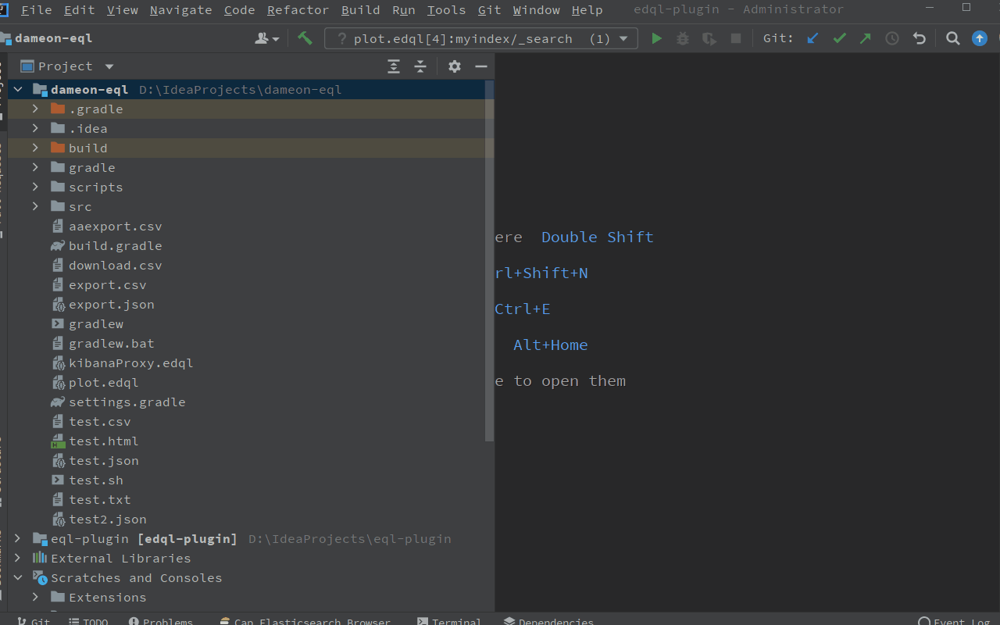
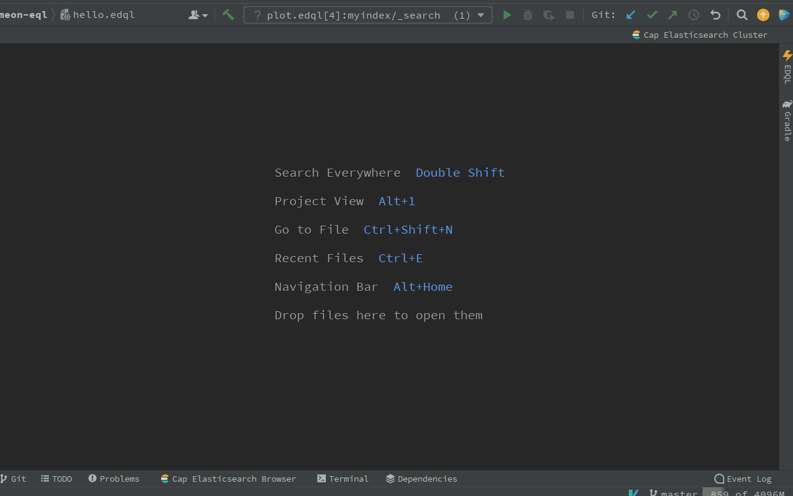
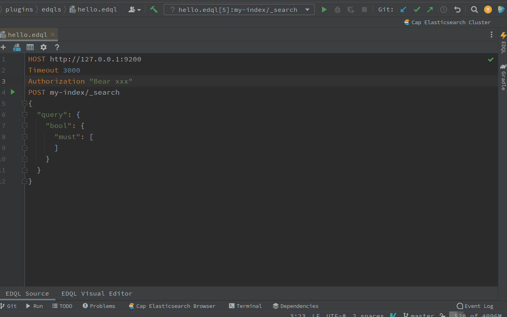

# Create EDQL Script

## New EDQL file by New File

it will auto fill the HOST, Timeout and Authorization with a simple EDQL Action. the EDQL file will stored in current file directory.



## New EDQL by the Manager Dashboard

it will auto fill the HOST, Timeout and Authorization with a simple EDQL Action, the EDQL file will be stored in the Manager like the Scratches files.



## Configure by Visual Editor

After creating an EDQL file, we can quickly configure by the visual editor for easily configuration.&#x20;



## Configurations

### HOST

HOST mean the Elasticsearch host endpoint, that we want to query and manage Elasticsearch Cluster.

```
HOST http://127.0.0.1:920
```

### KIBANA\_HOST

If we can't directly connect to Elasticsearch Cluster host, but we can connect to Kibana, we can configure the KIBANA\_HOST for Elasticsearch Cluster proxy

```
KIBANA_HOST http://localhost:5601/
```

### Timeout

Timeout is used to control the every action request timeout, like query, write and delete etc

```
Timeout 3000
```

### Authorization

If Elasticsearch Cluster configured the Authorization, we need to configure the Authorization for connect to Elasticsearch Cluster, for example: basic authorization, elastic cloud authorization, AWS credentials

#### Authorization header

```
Authorization "Bear xxx"
```

#### Basic Username and Password

```
Username "u"
Password "p"
```

#### ApiKey Credential

```
ApiKeyId "a"
ApiKeySecret "c"
```

#### AWS Credential

```
AWSRegion "us-east"
ApiKeyId "c"
ApiKeySecret "c"
ApiSessionToken "c"
```
