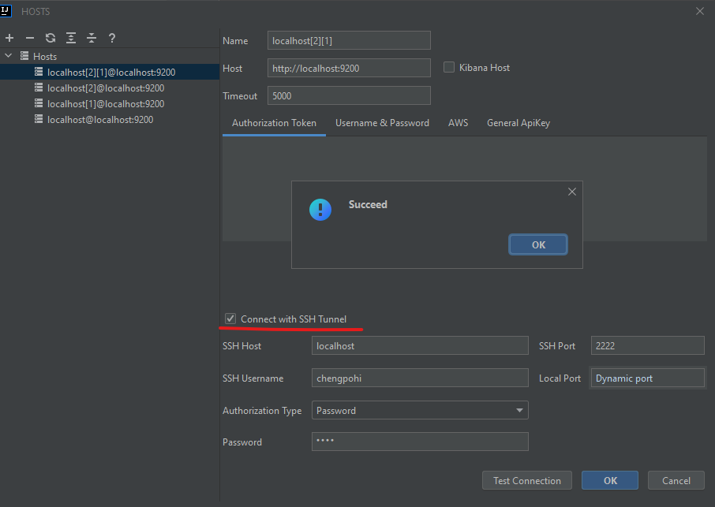
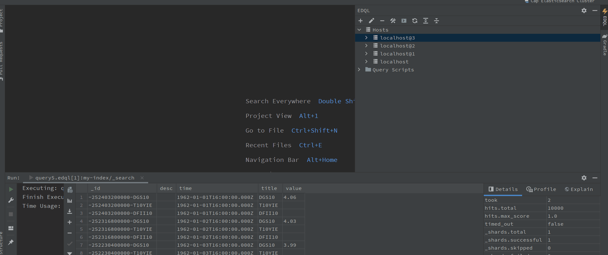
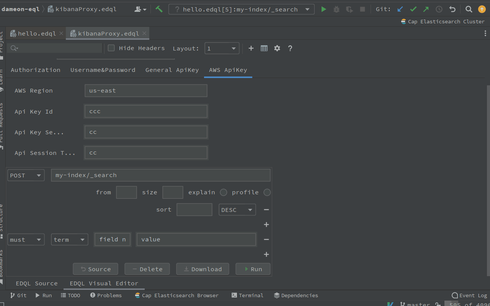

# Connect and Query

## Connection

Connect to Elasticsearch by using EDQL Dock Manage default **on the Intellij right side**. In the EDQL Dock Manager, you can **add new connection to connect Elasticsearch and Test connection**.


View more on:


[dock-manager.md](../ide-actions/dock-manager.md)


## Authorization

### Authorization Token

Use authorization token to connect Elasticsearch cluster, such as basic token, bearer token or custom token

### Username & Password

Basic username, password

### AWS

Use aws region, api key id, api key secret to connect aws Elasticsearch

### General ApiKey

User general api key to connect Elasticsearch cluster, such as Elastic cloud

### SSH Tunnel

Use SSH tunnel encrypt a connection between a client and a server to connect Server, or make connections inside same VPC(Virtual Private Cloud), Example: connect aws server in same VPC.

<figure><figcaption></figcaption></figure>

## Query Console

After create and test a connection of Elasticsearch, you can create new query console on the Dock Toolbar with terminal icon



## Query by Visual Editor

After EDQL file is created, we can use the **Visual Editor** to configure an query action, since the common query conditions are annoying and boring.  Visual Editor is a powerful tool to visual query conditions and configurations, example: term match, range query, wildcard query and size, explan etc.


```
```


