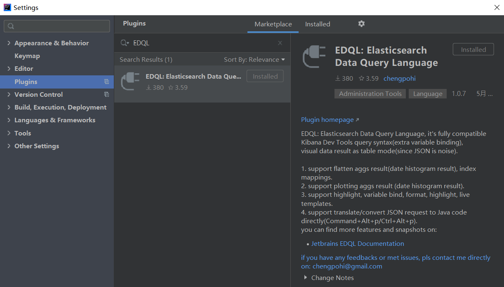
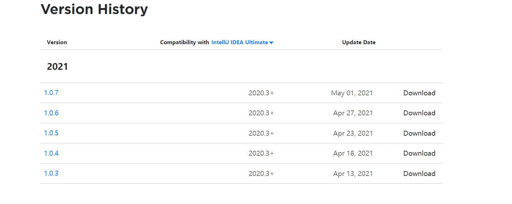

# Install on Intellij

**EDQL** plugin is based on Jetbrains IDE platform, and support version >= 203, it can be installed on Intellij, Webstorm, Go Land Jetbrains IDE. Also since Jetbrains IDE platform is cross platform, it can be installed on Windows, MacOS and Linux operating systems.

For different use cases, there are two ways to install EDQL on Intellij IDE Platform

### Install EDQL from IDE Plugin Marketplace

Install from Intellij Plugins Marketplace is the simplest way to install EDQL, just open the Intellij plugins marketplace and search **EDQL,** download, install and restart IDE. also EDQL updates will notify by Intellij updates notification.

### Download EDQL from website and Install

In some cases, it's impossible to use Intellij Plugins Marketplace, you can go to [EDQL Plugin](https://plugins.jetbrains.com/plugin/16364-edql-elasticsearch-data-query-language) website, choose the **newest** version and download plugin zip.

After downloaded, open IDE plugin dialog, and choose install plugin from disk with **downloaded EDQL zip,** also restart Intellij IDE

.png>)
