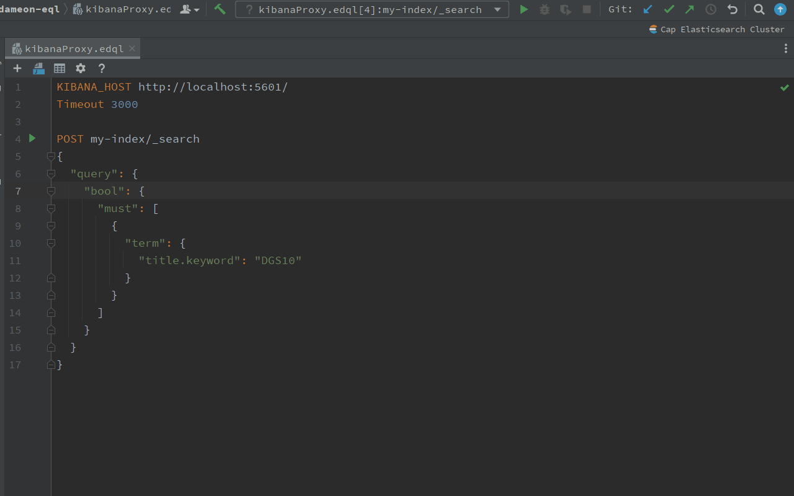
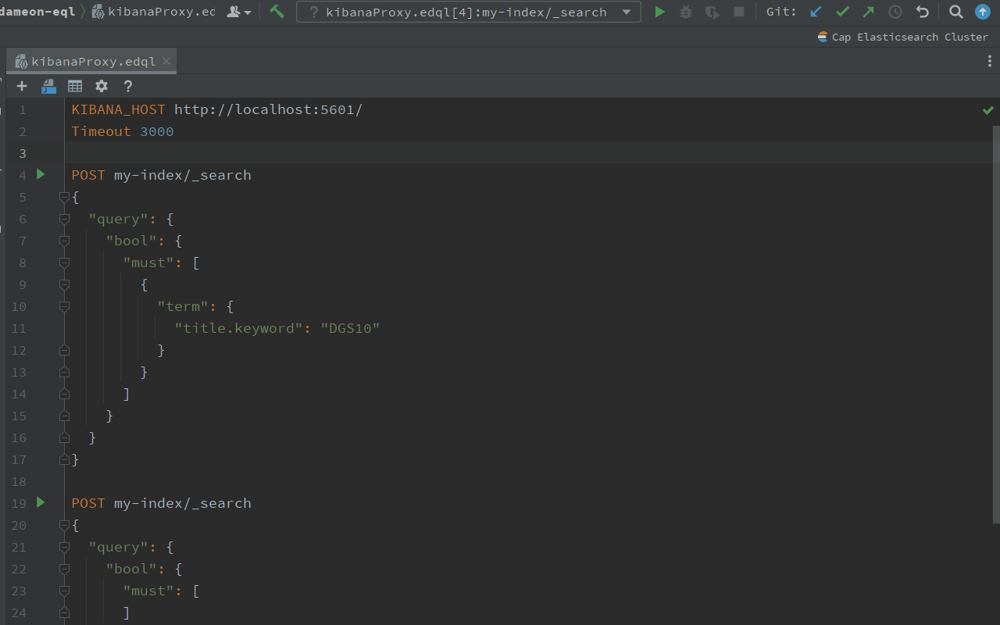
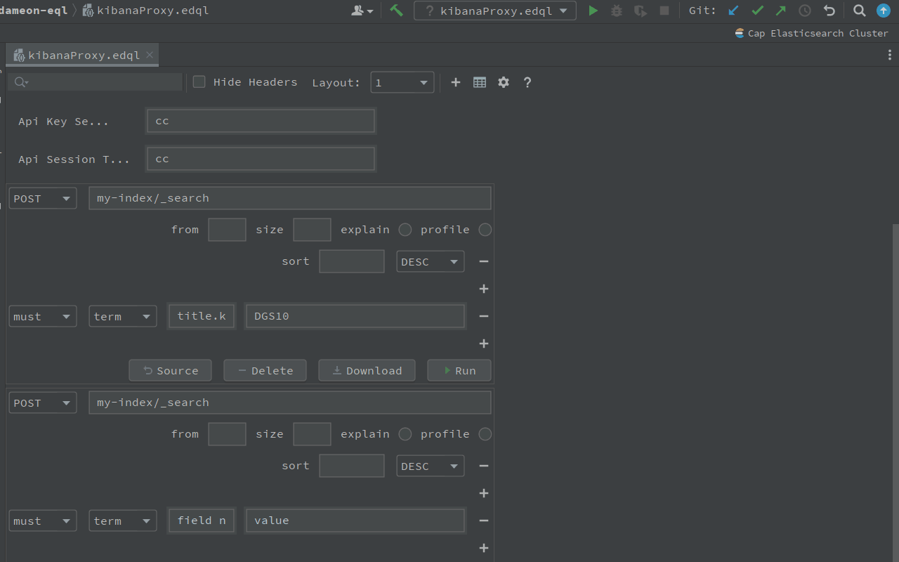

# Run EDQL Query and Data Viewer

## Run with Intellij IDE

EDQL is a script, it's easy to run and execute on Intellij IDE, the EDQL minimum run block is Query Action, also support run whole script. The following 3 ways to run EDQL script by Intellij.&#x20;

### Run Single Action

We can run single action by click action left icon directly or when cursor stay on the request action block use the Run shortcut directly, also you can use click right mouse with run to run. it will only run current request action and return current request action response:

### Run Whole Script

when EDQL script has multiple actions, we can run all actions when cursor not on any request action block and use Run shortcut to run whole requests also you can use right mouse for run. For multiple request actions, multiple responses will return, and display with multiple tabs for every result:

## Run with Visual Editor

when switch in Visual Editor, Also we can just use Run button on every action block to run:

